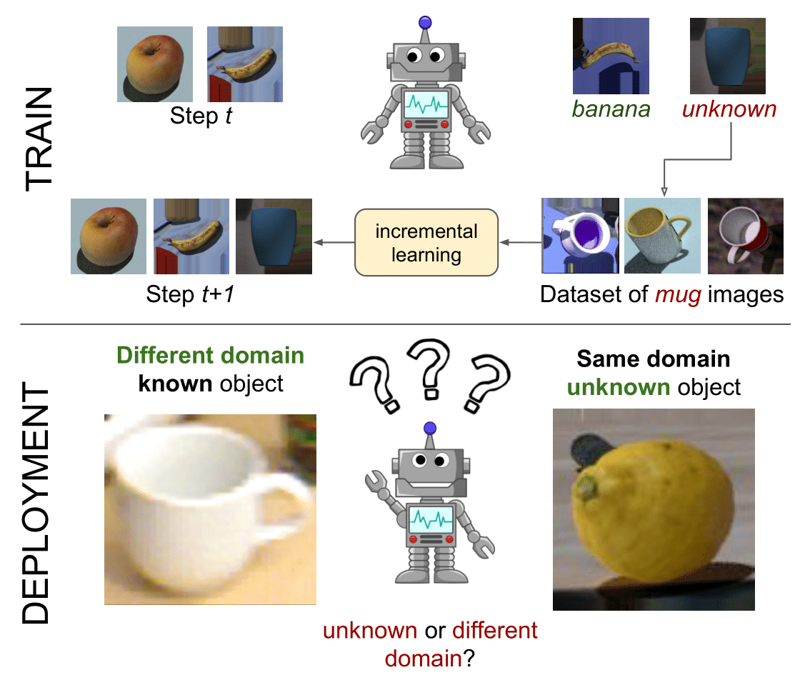

# On the Challenges of Open World Recognition under Shifting Visual Domains

This is the official code implementation of the paper **"On the Challenges of Open World 
Recognition under Shifting Visual Domains"** by Dario Fontanel, Fabio Cermelli, Massimiliano
 Mancini and Barbara Caputo accepted at **IEEE RA-L** and **IEEE ICRA 2021**.

[[article]](https://ieeexplore.ieee.org/abstract/document/9309407)
[[arXiv]](https://arxiv.org/abs/2107.04461)



In OWR a robot is asked to incrementally learn new concepts over time while detecting images
 containing unseen concepts. Our research question is: does the effectiveness of the visual
  system hold when acting in different visual domains and environments?

## Installation
To clone the repo:
```bash
cd ~
git clone https://github.com/DarioFontanel/OWR-VisualDomains.git
```

To create the [conda](https://docs.conda.io/en/latest/miniconda.html) environment:
```bash
cd ~/OWR-VisualDomains/docs
conda env create --name owr --file=environment.yml
conda activate owr
```

## Data preparation
The data directory should look like as follows:

```
~/OWR-VisualDomains/
      |----data/
          |----fixed_order.npy
          |----{dataset}/
                    |----{dataset}/
                    |----{dataset}_reorganized/
                                  |----apple/
                                  |----ball/
                                  |----...
                    |----additionals/
                                  |----test.txt
                                  |----train.txt
                                  |----val.txt

```
where `{dataset}` is the folder containing the available datasets among `[rgbd-dataset, arid_40k_dataset_crops, synARID_crops_square]`

To reproduce this directory tree, download the datasets from 
[rgbd-dataset](https://rgbd-dataset.cs.washington.edu/dataset/rgbd-dataset/rgbd-dataset.tar), 
[arid_40k_dataset_crops](https://data.acin.tuwien.ac.at/index.php/s/N36WkX6FNQNDinX), 
[synARID_crops_square](https://data.acin.tuwien.ac.at/index.php/s/u4KuUVlUnkkzxhd)
and ***respectively*** place them in `~/OWR-VisualDomains/data/{dataset}/`.

Extract them in the same folder and then run the following scripts to reorganize each of them.
* `rgbd-dataset`

```bash
cd ~/OWR-VisualDomains/scripts
python dataset_unpack_instances.py --dataset rgbd-dataset
``` 

* `arid_40k_dataset_crops`
```bash
cd ~/OWR-VisualDomains/scripts
python dataset_unpack_instances.py --dataset arid_40k_dataset_crops
```

* `synARID_crops_square`

At the time of creating this repo, in the downloaded dataset the label *bell_pepper* is improperly named *bell_papper*. 
If there is still this mismatch, just run the following script to rename all the data correctly.   
```bash
cd ~/OWR-VisualDomains/scripts
python synARID_crops_square_rename_bell_pepper.py
```

Just for the sake of code simplicity, please rename the folder *synARID_crops_square* as follows:
```bash
cd ~/OWR-VisualDomains/data/synARID_crops_square/
mv synARID_crops_square/ synARID_crops_square_reorganized/
``` 

Now we are ready to execute code.

## Validation protocol for OWR best params
If you are interest in performing the validation research protocol, then run
```bash
python main.py --name {name} --{method} --dataset {dataset} --search
```

where 
* `{method}` is the chosen OWR method among `[nno, deep_nno, bdoc]`
* `{name}` is the name of the experiment, default is `exp`
* `{dataset}` is the chosen training dataset among `[rgbd-dataset, arid_40k_dataset_crops, synARID_crops_square]`

After the validation, the directory tree will look like the following one:
```
~/OWR-VisualDomains/
      |----logs/
          |----{dataset}/
                   |----search/
                          |----{name}_search.txt
      |----data/
              |----{dataset}/
                        |----additionals/
                                  |----{name}_{dataset}_best_config.npy
```
where 
* `{name}_{dataset}_best_config.npy` contains the best configuration for each parameter
* `{name}_search.txt` contains all the evaluations made during the search operation
 
## Pipeline
#### Training
If you are interested in training OWR models by loading the configurations you have just created, then run
```bash
cd ~/OWR-VisualDomains
python main.py --name {name} --{method} --dataset {dataset} --config {config}
```

where `{config}` needs to be `{name}_{dataset}_best_config.npy`.

If you are instead interested in training OWR models by loading the configurations we provide, then run
```bash
cd ~/OWR-VisualDomains
python main.py --name {name} --{method} --dataset {dataset} --config default --test {test} --{DG}
```

where
* `test` allows to chose on which dataset(s) the model will be tested (default: `all` which uses all the three datasets)
* `DG` allows to chose a Domain Generalization technique by using the following commands:
    * `rsda` for [Data augmentation with transformation sets (RSDA)](https://openaccess.thecvf.com/content_ICCV_2019/papers/Volpi_Addressing_Model_Vulnerability_to_Distributional_Shifts_Over_Image_Transformation_Sets_ICCV_2019_paper.pdf)
    * `ssw` to set the weight for [Self-supervised learning with relative rotations (RR)](https://www.ecva.net/papers/eccv_2020/papers_ECCV/papers/123610409.pdf)
    * `self_challenging` for [Regularization through self-challenging (SC)](https://arxiv.org/pdf/2007.02454.pdf)   
    
#### Evaluation
The results can be evaluated by checking:
* the .txt file named `{name}.txt` that can be found at 
```
~/OWR-VisualDomains/
      |----logs/
          |----{dataset}/
                   |----{name}.txt  
```
* tensorboard logs, by running
```bash
cd ~/OWR-VisualDomains
tensorboard --logdir logs/
```


## Cite us
If you use this repository, please consider to cite

```
@article{fontanel2021challenges,
  author={Fontanel, Dario and Cermelli, Fabio and Mancini, Massimiliano and Caputo, Barbara},
  journal={IEEE Robotics and Automation Letters},
  title={On the Challenges of Open World Recognition Under Shifting Visual Domains},
  year={2021},
  volume={6},
  number={2},
  pages={604-611},
  doi={10.1109/LRA.2020.3047777}
}
```

___
For any additional information or requests, please contact [Dario Fontanel](mailto:dario.fontanel@polito.it) at ***dario.fontanel AT polito.it***.